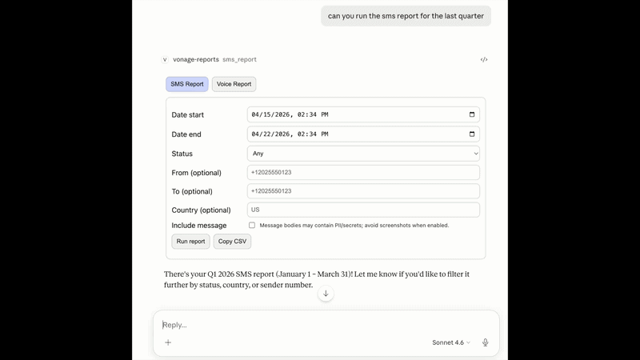

# Vonage Reports MCP App (Claude Desktop)

Interactive in-chat dashboard (MCP Apps) that turns raw Vonage SMS and Voice call records into a live, filterable reporting interface. This app wraps the Vonage Tooling MCP server's `get-records-report` tool behind two friendly, UI-backed tools: `sms_report` and `voice_report`.

The server acts as a proxy between your Claude chat and the Vonage API, normalizing responses and masking sensitive phone numbers before they reach the UI. Phone numbers are masked by default (last 4 digits only), and `include_message` is off by default to protect PII in message bodies. The entire UI is bundled into a single self-contained HTML file and renders inline inside Claude Desktop — no external browser tab needed.



## Prerequisites

- Claude Desktop (latest version)
- A Vonage API account with active credentials
- Node.js 18+ (only required if building from source; pre-built release doesn't need it)

## Quick Start (5 Minutes)

### Option 1: Download Pre-Built Release (Recommended)

1. **Download** the latest release from [GitHub Releases](https://github.com/Vonage-Community/blog-mcp_tooling-mcp_apps_reporting_ui/releases):
   ```bash
   tar -xzf vonage-reports-mcp-app-v0.1.0.tar.gz -C ~/vonage-reports-app/
   ```

2. **Configure** Claude Desktop — Open `claude_desktop_config.json` (`~/Library/Application Support/Claude/` on macOS, `%APPDATA%\Claude\` on Windows) and add:
   ```json
   {
     "mcpServers": {
       "vonage-reports": {
         "command": "node",
         "args": ["/path/to/vonage-reports-app/dist/server.js"],
         "env": {
           "VONAGE_API_KEY": "your_api_key",
           "VONAGE_API_SECRET": "your_api_secret",
           "VONAGE_APPLICATION_ID": "your_app_id",
           "VONAGE_PRIVATE_KEY64": "your_private_key_base64",
           "VONAGE_VIRTUAL_NUMBER": "your_virtual_number"
         }
       }
     }
   }
   ```

3. **Restart** Claude Desktop completely

4. **Open** the Vonage Reports Dashboard in Claude — you'll see two tabs: SMS Report and Voice Report

---

## Build from Source

### Option 2: Clone the Repo and Build Locally

1. **Clone** and install dependencies:
   ```bash
   git clone https://github.com/Vonage-Community/blog-mcp_tooling-mcp_apps_reporting_ui.git
   cd vonage-reports-mcp-app
   npm install
   npm run build
   ```

2. **Configure** Claude Desktop with the local path:
   ```json
   {
     "mcpServers": {
       "vonage-reports": {
         "command": "node",
         "args": ["/ABSOLUTE/PATH/TO/vonage-reports-mcp-app/dist/server.js"],
         "env": {
           "VONAGE_API_KEY": "...",
           "VONAGE_API_SECRET": "..."
         }
       }
     }
   }
   ```

3. **Restart** Claude Desktop

---

## How It Works

When you invoke `sms_report` or `voice_report` in Claude, the dashboard renders inline. The app:

- **Proxies** to the Vonage tooling MCP server's `get-records-report` tool
- **Normalizes** responses into a consistent schema
- **Masks** phone numbers on the server side before display
- **Renders** a full two-tab UI with filters, pagination, KPI cards, and expandable rows

**SMS Report tab:**
- Date range filtering (defaults to last 7 days)
- Status filtering (delivered, failed, rejected, submitted, etc.)
- Sender/recipient phone number filters
- Optional message content expansion (off by default; see warning below)
- Copy results to clipboard as CSV

**Voice Report tab:**
- Date range filtering
- Status and direction (inbound/outbound) filters
- Browse call records with pagination
- Click to expand and view all call details

---

## Security & Privacy

- **Phone numbers** are masked server-side — only the last 4 digits are visible in the UI
- **Message content** (`include_message: true`) is off by default; enable only when needed and be cautious with screenshots/exports as messages may contain OTP codes, personal info, or other PII
- All data masking happens before reaching the browser, so exports and screenshots are safe by default

---

## Notes

- This server spawns the Vonage tooling server as a subprocess:
  ```
  npx -y @vonage/vonage-mcp-server-api-bindings
  ```
- For detailed build walkthrough, architecture, and debugging insights, see the [Vonage Developer Blog tutorial](https://developer.vonage.com/en/blog/) *(link to be added when published)*

---

## Extending the App

Some ideas for extensions:

- **Export to Downloads** — Use Node.js filesystem APIs in the server to write CSV directly to `~/Downloads/`
- **Real-time monitoring** — Poll the API on an interval and stream live stats
- **Custom alerts** — Use the Vonage tooling server to send SMS, RCS, or voice call alerts when unusual patterns are detected
- **Multi-account support** — Switch between different Vonage sub-accounts in the UI

---

## License

MIT
